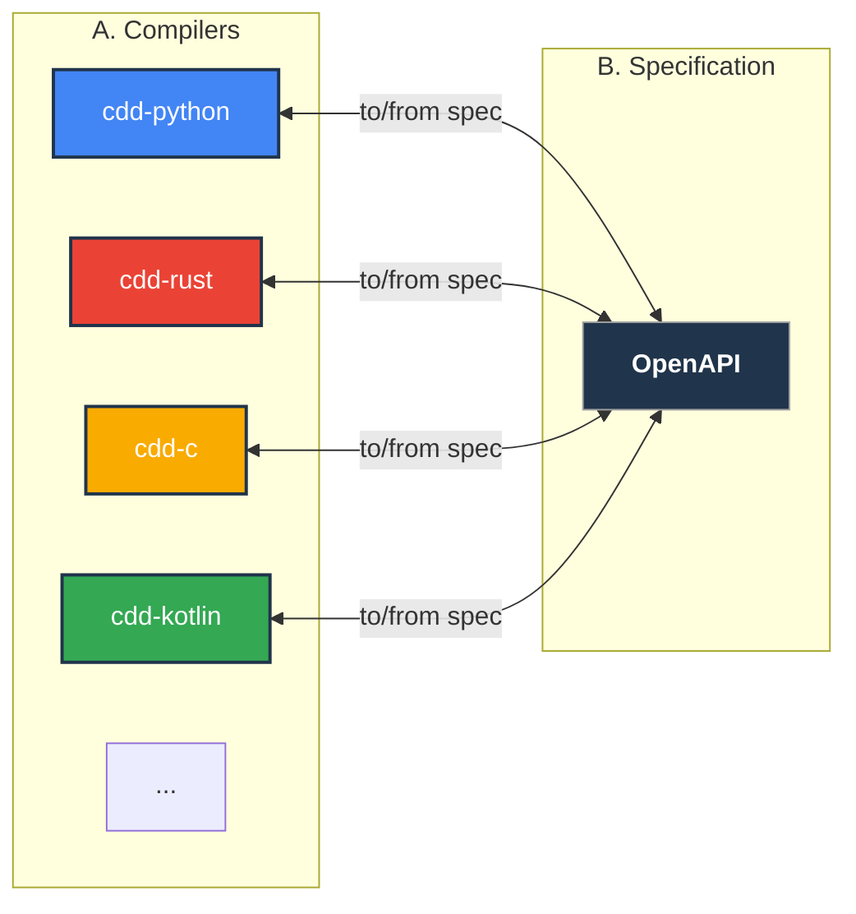
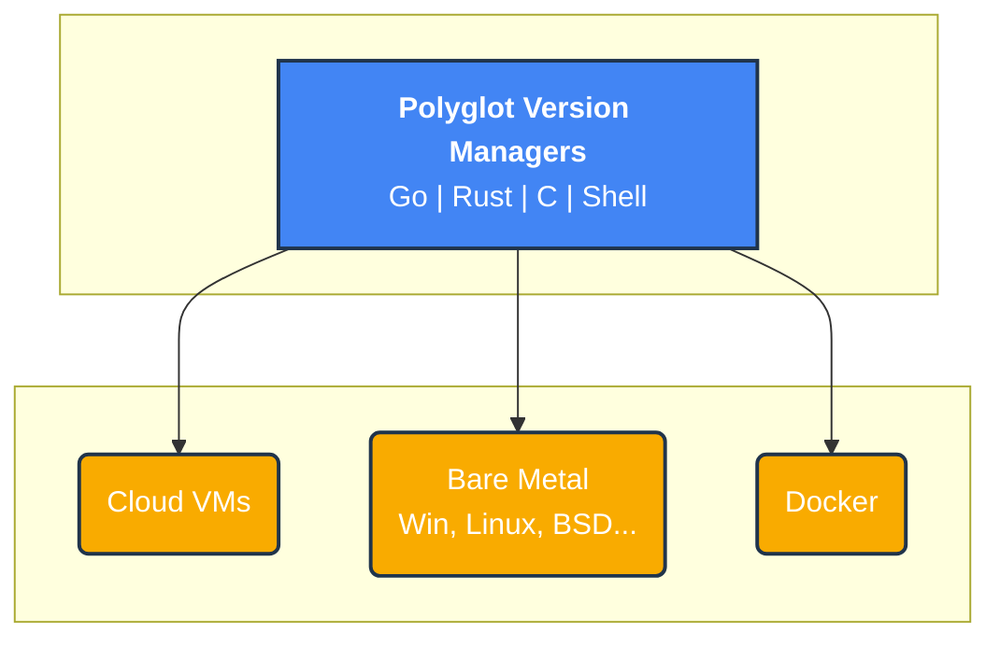

Both scaling source-code and scaling deployments are difficult. They need not be.

I build tools for a different philosophy of software engineering… one that rejects the bloated, non-native defaults of the modern stack.

 - **Restore Monolithic Velocity**: Polyglot systems—separate backend(s) from frontend(s)—create a "synchronisation tax" that kills development speed. My `cdd` compilers automate this away, making multi-language development as fast as a _Ruby on Rails_ or _Django_. And synchronises tests and docs also; improving software quality.
 - **Demystify Deployment**: Software deployment is not as complex as the industry makes it seem. My **[verMan.io](https://verMan.io)** toolchain provides a direct path to reproducible, cross-platform, bare-metal environments, making containers a choice, not a mandate.
 - **Outpace ML Fragmentation**: The pace of ML innovation is relentless. My **[kitchenSink.ai](https://kitchenSink.ai)** compilers treat entire ML frameworks as its search space. And my [ml-switcheroo](https://samuelmarks.github.io/ml-switcheroo) project translates code betwixt ML frameworks.

---
### Bidirectional Code Synchronisation

My `cdd` compilers are the engine for restoring monolithic velocity. Each one works **bidirectionally**: you can generate typed code *from* a specification, or derive a specification *from* well-structured code. This keeps your polyglot architecture perfectly synchronised.

This toolkit eliminates boilerplate for data models, API clients | servers routes, and tests, enabling maximum code reuse while demanding truly native performance.

| Repository | Language | Client or Server | Extra features | OpenAPI Standard | CI Status |
|---|---|---|---|---|---|
| [`cdd-c`](https://github.com/SamuelMarks/cdd-c) | C (C89) | Client | FFI | OpenAPI 3.2.0 |  |
| [`cdd-cpp`](https://github.com/SamuelMarks/cdd-cpp) | C++ | Client | Upgrades Swagger & Google Discovery to OpenAPI 3.2.0 | Swagger 2.0 until OpenAPI 3.2.0 |  |
| [`cdd-csharp`](https://github.com/SamuelMarks/cdd-csharp) | C# | Client | CLR | OpenAPI 3.2.0 |  |
| [`cdd-go`](https://github.com/SamuelMarks/cdd-go) | Go | Client |  | OpenAPI 3.2.0 |  |
| [`cdd-kotlin`](https://github.com/SamuelMarks/cdd-kotlin) | Kotlin (Multiplatform) | Client | Admin UI | OpenAPI 3.2.0 |  |
| [`cdd-php`](https://github.com/SamuelMarks/cdd-php) | PHP | Client |  | OpenAPI 3.2.0 |  |
| [`cdd-python`](https://github.com/offscale/cdd-python) | Python | N/A (server building blocks) | CLI ↔ SQL ↔ Pydantic ↔ docs ↔ JSON-schema | N/A |  |
| [`cdd-python-client`](https://github.com/offscale/cdd-python-client) | Python | Client |  | OpenAPI 3.2.0 |  |
| [`cdd-ruby`](https://github.com/SamuelMarks/cdd-ruby) | Ruby | Client |  | OpenAPI 3.2.0 |  |
| [`cdd-rust`](https://github.com/SamuelMarks/cdd-rust) | Rust | Client & Server | CLI frontend for SDK | OpenAPI 3.2.0 |  |
| [`cdd-sh`](https://github.com/SamuelMarks/cdd-sh) | Shell (/bin/sh) | Client |  | OpenAPI 3.2.0 |  |
| [`cdd-swift`](https://github.com/offscale/cdd-swift) | Swift | Client |  | OpenAPI 3.2.0 |  |
| [`cdd-web-ng`](https://github.com/offscale/cdd-web-ng) | TypeScript | Client | Auto-Admin UI; Angular; fetch; Axios; Node.js | OpenAPI 3.2.0 & Swagger 2 |  |

**Application: Outpacing ML**
The [`cdd-python`](https://github.com/offscale/cdd-python) compiler powers the [kitchenSink.ai](https://kitchenSink.ai) project. My [ml-switcheroo](https://samuelmarks.github.io/ml-switcheroo) project translates translates models, operations, lifecycles, and general I/O betwixt frameworks.

 | Google                                                             | Other vendors                                               |
 | ------------------------------------------------------------------ | ----------------------------------------------------------- |
 | [tensorflow](https://github.com/SamuelMarks/ml-params-tensorflow)  | [pytorch](https://github.com/SamuelMarks/ml-params-pytorch) |
 | [keras](https://github.com/SamuelMarks/ml-params-keras)            | [skorch](https://github.com/SamuelMarks/ml-params-skorch)   |
 | [flax](https://github.com/SamuelMarks/ml-params-flax)              | [sklearn](https://github.com/SamuelMarks/ml-params-sklearn) |
 | [trax](https://github.com/SamuelMarks/ml-params-trax)              | [xgboost](https://github.com/SamuelMarks/ml-params-xgboost) |
 | [jax](https://github.com/SamuelMarks/ml-params-jax)                | [cntk](https://github.com/SamuelMarks/ml-params-cntk)       |

---
### Demystifying Deployment

Applications, databases, and ML can be deployed with **[verMan.io](https://verMan.io)**—my answer to the heavyweight, container-first paradigm. You can still use this within containers, but you are not limited to non-native abstractions like Docker.

This toolkit uses lightweight, purpose-built _package managers_ for direct and efficient deployment. These work with or without Docker, Kubernetes, etc.

*   **Core Managers**: `rvm`/`nvm`-style _package managers_ written in [Go](https://github.com/offscale/postgres-version-manager-go), [Rust](https://github.com/orgs/offscale/repositories?q=-version-manager-rs), and [C](https://github.com/offscale/libacquire) for consistent cross-platform dependency and version management.
*   **Orchestration Layer**: A mature Python toolkit to automate deployments across 50+ cloud providers.

| Purpose                                                                  | Repo                                                   |
| ------------------------------------------------------------------------ | ------------------------------------------------------ |
| Provision nodes specified in JSON, across 50+ clouds                     | [offstrategy](https://github.com/offscale/offstrategy) |
| SSH into node provisioned by offstrategy\|offset                         | [offshell](https://github.com/offscale/offshell)       |
| Deprovision node provisioned by offstrategy\|offset from cloud providers | [offswitch](https://github.com/offscale/offswitch)     |
| Bring Your Own Node (BYON) [so can use ↕]                                | [offset](https://github.com/offscale/offset)           |
| Deploy any of [50 "offregister-" prefixed](https://github.com/orgs/offscale/repositories?q=offregister-&language=python) softwares—including clustered databases—to nodes provisioned by offstrategy\|offset | [offregister](https://github.com/offscale/offregister) |
